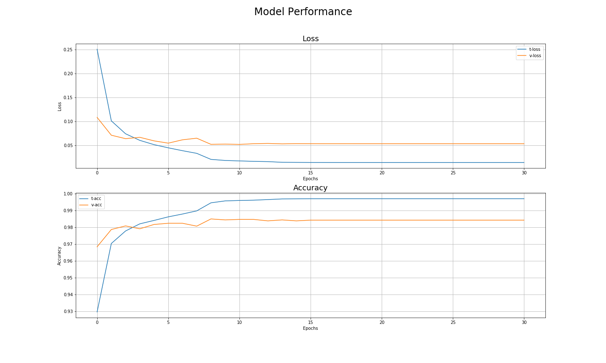

# Digit Recognition

Classes:
    
             0, 1, 2, 3, 4, 5, 6, 7, 8, 9

Dataset: MNIST             
___
## Non Equalized Images
### Model Architecture

### Model Performance

___
## Equalized Images
### Model Architecture

### Model Performance
