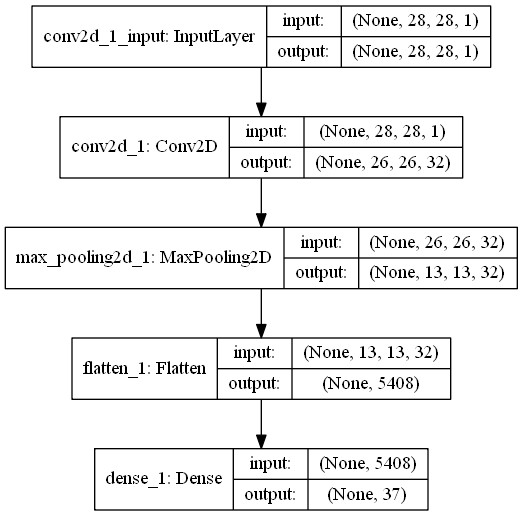
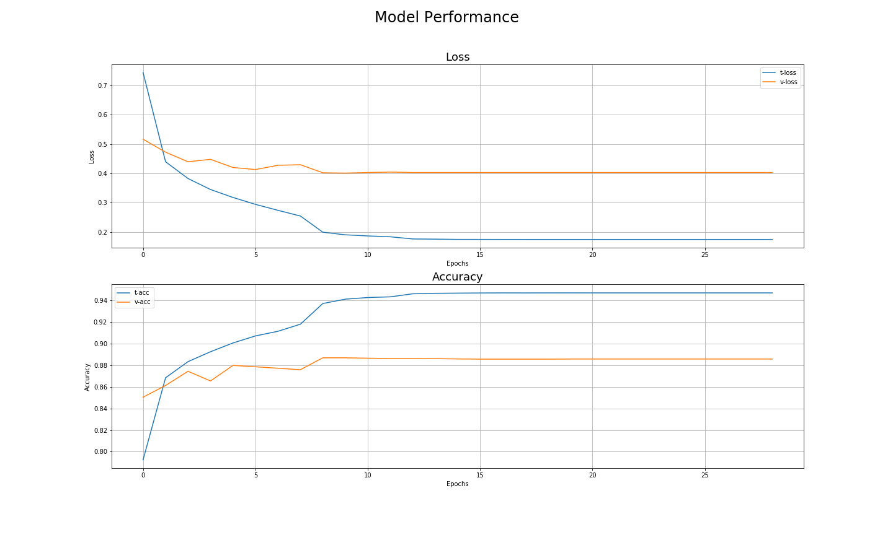
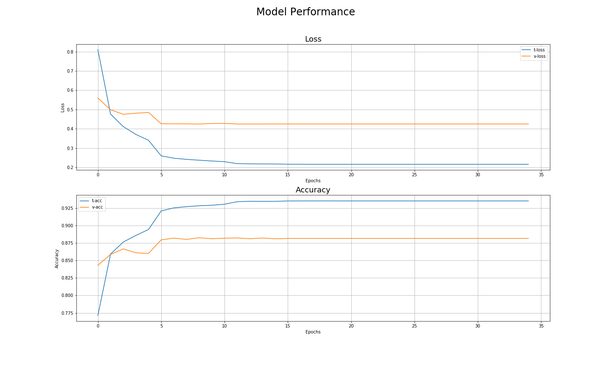

# Alnum Recognition

Classes:
    
    A B C D E F G H I J K L M N O P Q R S T U V W X Y Z a b d e f g h n q r t

Dataset: EMNIST-balanced          
___
## Non Equalized Images
### Model Architecture

### Model Performance

___
## Equalized Images
### Model Architecture

### Model Performance
